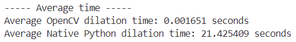

# Лабораторная 1
## Цель
Научиться реализовывать один из простых алгоритмов обработки изображений.

## Задание 
1. Реализовать программу согласно варианту задания. Базовый алгоритм, используемый в программе, необходимо реализовать в 2 вариантах: с 
использованием встроенных функций какой-либо библиотеки (OpenCV, PIL и др.) и нативно на Python или C++. 
2. Сравнить быстродействие реализованных вариантов. 
3. Сделать отчёт в виде readme на GitHub, там же должен быть выложен исходный код.

## Вариант
Дилатация, примитив размера 3 на 3, бинаризацию можно не реализовывать вручную.

## Реализация

### Теоретическая база
Дилатация (расширение) — это морфологическая операция, используемая в обработке изображений для расширения белых областей изображения (объектов) за счет черных областей (фона). Операция заключается в применении структурного элемента (ядра) ко всем пикселям изображения, при этом в каждой области, охваченной ядром, пикселю присваивается максимальное значение из этой области.

Операция дилатации может быть полезна для заполнения пробелов внутри объектов или увеличения видимого размера объектов на изображении. Она применяется, например, при подготовке изображений для распознавания и выделения объектов.

<div align="center">
  <figure style="display:inline-block; margin: 10px;">
    
    <figcaption>Оригинальное изображение</figcaption>
  </figure>
  <figure style="display:inline-block; margin: 10px;">
    
    <figcaption>Результат дилатации</figcaption>
  </figure>
</div>


#### Алгоритмы и принципы работы
- **OpenCV реализация**: использует встроенную функцию `cv2.dilate`, которая применяет ядро ко всем пикселям изображения и выполняет операцию дилатации на основе оптимизированных функций библиотеки.
  
- **Нативная реализация**: создается копия изображения с дополнительными пикселями по краям для обработки границ, после чего выполняется проход по каждому пикселю изображения. На каждом шаге применяется ядро 3x3, и пикселю присваивается максимальное значение в соответствующей области.

### Код нативной реализации
```python
import numpy as np

# Нативная реализация дилатации
def dilate_native(image, kernel):
    padded_image = np.pad(image, 1, mode='constant', constant_values=0)
    dilated_image = np.zeros_like(image)
    for i in range(1, image.shape[0] + 1):
        for j in range(1, image.shape[1] + 1):
            dilated_image[i-1, j-1] = np.max(padded_image[i-1:i+2, j-1:j+2] * kernel)
    return dilated_image
```

## Результаты работы и тестирования системы

### Скриншоты и изображения
Ниже приведены результаты работы алгоритмов.

**Маленькое изображение**
<div align="center">
  <figure style="display:inline-block; margin: 10px;">
    
    <figcaption>Оригинальное изображение</figcaption>
  </figure>
  <figure style="display:inline-block; margin: 10px;">
    
    <figcaption>Результат OpenCV</figcaption>
  </figure>
  <figure style="display:inline-block; margin: 10px;">
    
    <figcaption>Результат нативной реализации</figcaption>
  </figure>
</div>

**Большое изображение**

<div align="center">
  <figure style="display:inline-block; margin: 10px;">
    
    <figcaption>Оригинальное изображение</figcaption>
  </figure>
  <figure style="display:inline-block; margin: 10px;">
    
    <figcaption>Результат OpenCV</figcaption>
  </figure>
  <figure style="display:inline-block; margin: 10px;">
    
    <figcaption>Результат нативной реализации</figcaption>
  </figure>
</div>


### Временные затраты

*Среднее время выполнения алгоритмов за 100 итераций*

Для оценки производительности каждого метода алгоритмы прогоняются по 100 раз. Вычисляется среднее время выполнения:



### Сравнение изображений

Выполняется побайтовое сравнение двух изображений (результатов OpenCV и нативного метода). Подсчитывается процент совпадения пикселей, что позволяет оценить точность реализации нативного алгоритма.


## Выводы
Был реализован алгоритм делатации c ядром 3*3. Также было произведено сравнение с реализацией алгоритма из библиотеки OpenCV. Обе реализации успешно выполняют операцию дилатации, однако нативная реализация на Python значительно уступает по скорости встроенной функции из OpenCV. Это связано с оптимизациями, реализованными в OpenCV, которые снижают временные затраты на обработку изображения.

## Использованные источники
[Документация OpenCV](https://docs.opencv.org/3.4/db/df6/tutorial_erosion_dilatation.html) 

[Erosion and Dilation of images using OpenCV in python](https://docs.opencv.org/3.4/db/df6/tutorial_erosion_dilatation.html)