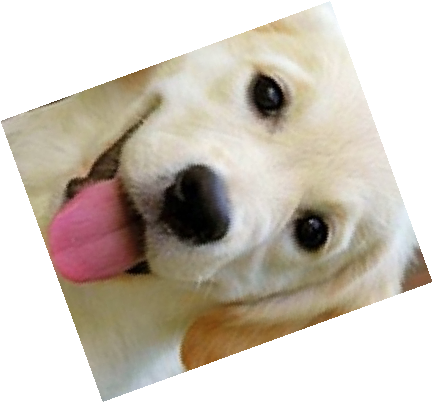

# Лабораторная 2
## Цель
Реализовать простейшие алгоритмы сопоставления изображений.

## Задание
1. Реализовать программу согласно описанию. Можно использовать языки C++ или Python и любые библиотеки.
2. Сравнить качество работы двух вариантов реализации по точности детектирования.
3. Сделать отчёт в виде readme на GitHub,там же должен быть выложен исходный код.

## Описание
Необходимо реализовать два алгоритма поиска эталона на входном изображении:
1. Прямой поиск одного изображения на другом (template matching)
2. Поиск ключевых точек эталона на входном изображении (например, с
помощью SIFT)

## Реализация

## Теоретическая база

### Прямой поиск (Template Matching)
Template Matching — это метод поиска похожих областей изображения. Для поиска шаблона на изображении используется свертка, при которой шаблон "перемещается" по изображению и для каждого положения вычисляется степень совпадения (например, с помощью корреляции). Чем выше значение степени совпадения, тем более вероятно, что искомый объект находится в этом месте.

Основные методы, используемые в Template Matching:
- *cv2.TM_CCOEFF* — коэффициент корреляции между изображением и шаблоном.
- *cv2.TM_SQDIFF* — минимизация разницы между изображением и шаблоном.

### Поиск ключевых точек с использованием SIFT
SIFT (Scale-Invariant Feature Transform) — это алгоритм, предназначенный для извлечения ключевых точек из изображения, устойчивых к изменениям масштаба, вращению и освещению. Алгоритм SIFT ищет интересные точки (например, углы или края), а затем описывает их локальные особенности с помощью дескрипторов.

С помощью SIFT можно найти ключевые точки на изображении и сопоставить их с точками на другом изображении, что позволяет обнаружить схожие объекты даже при изменении угла обзора, масштаба или освещенности.

## Описание разработанной системы

### Алгоритмы и принципы работы

*1. Прямой поиск изображения (Template Matching)*
    
  В OpenCV для выполнения прямого поиска используется функция `cv2.matchTemplate`. Шаблон накладывается на изображение, и для каждого положения вычисляется степень совпадения. Метод возвращает карту соответствий, на основе которой можно вычислить местоположение шаблона на изображении.

*2. Поиск ключевых точек с использованием SIFT*
  
  Алгоритм SIFT используется для поиска и описания ключевых точек на изображении. Ключевые точки извлекаются, а затем их дескрипторы сопоставляются с дескрипторами другого изображения, используя, например, метод `cv2.BFMatcher`. Места с наибольшим количеством совпадений считаются вероятными участками, где может быть найден искомый объект.

### Архитектура системы
Система состоит из следующих основных компонентов:
- **Ввод данных**: программа принимает два изображения — эталон и изображение для поиска.
- **Обработка данных**:
    - Для метода Template Matching используется функция `cv2.matchTemplate`.
    - Для метода SIFT используется извлечение ключевых точек с помощью `cv2.SIFT_create()` и их сопоставление через `cv2.BFMatcher`.
- **Вывод результатов**: на изображение накладывается рамка, указывающая на найденную область, или отображаются совпадающие ключевые точки.

---

## Результаты работы и тестирования

Тестирование проводилось на нескольких изображениях, включая различные изменения масштаба, ракурса и освещенности объектов. Ниже приведены результаты.

### Скриншоты и изображения

***Различные варианты поворота***

<table align="center">
  <tr>
    <td align="center">
      
      
Поворот

    </td>
    <td align="center">
      
      
Template Matching

    </td>
    <td align="center">
      
      
SIFT Matching

    </td>
  </tr>
  <tr>
    <td align="center">
      
      
Поворот

    </td>
    <td align="center">
      
      
Template Matching

    </td>
    <td align="center">
      
      
SIFT Matching

    </td>
  </tr>
  <tr>
    <td align="center">
      
      
Поворот

    </td>
    <td align="center">
      
      
Template Matching

    </td>
    <td align="center">
      
      
SIFT Matching

    </td>
  </tr>
    <tr>
    <td align="center">
      
      
Поворот

    </td>
    <td align="center">
      
      
Template Matching

    </td>
    <td align="center">
      
      
SIFT Matching

    </td>
  </tr>
  <tr>
    <td align="center">
      
      
Поворот

    </td>
    <td align="center">
      
      
Template Matching

    </td>
    <td align="center">
      
      
SIFT Matching

    </td>
  </tr>
</table>

***Различные преобразования изображения***

<table align="center">
  <tr>
    <td align="center">
      
      
Высокая яркость

    </td>
    <td align="center">
      
      
Template Matching

    </td>
    <td align="center">
      
      
SIFT Matching

    </td>
  </tr>
  <tr>
    <td align="center">
      
      
Изменен масштаб

    </td>
    <td align="center">
      
      
Template Matching

    </td>
    <td align="center">
      
      
SIFT Matching

    </td>
  </tr>
  <tr>
    <td align="center">
      
      
Высокая контрастность

    </td>
    <td align="center">
      
      
Template Matching

    </td>
    <td align="center">
      
      
SIFT Matching

    </td>
  </tr>
  <tr>
    <td align="center">
      
      
Обрезанное изображение

    </td>
    <td align="center">
      
      
Template Matching

    </td>
    <td align="center">
      
      
SIFT Matching

    </td>
  </tr>
  <tr>
    <td align="center">
      
      
Горизонтальное отражение

    </td>
    <td align="center">
      
      
Template Matching

    </td>
    <td align="center">
      
      
SIFT Matching

    </td>
  </tr>
  <tr>
    <td align="center">
      
      
Вертикальное отражение

    </td>
    <td align="center">
      
      
Template Matching

    </td>
    <td align="center">
      
      
SIFT Matching

    </td>
  </tr>
</table>

### Результаты тестирования
Ниже приведены результаты по времени выполнения для каждого алгоритма и точности сопоставления:

**Время выполнения для всех тестов:**

## Выводы 

В ходе выполнения лабораторной работы было реализовано два метода поиска эталона на изображении:

**1. Прямой поиск (Template Matching)** оказался эффективным для поиска эталона на изображениях, где масштаб и ориентация объекта не изменяются. Этот метод быстрый, но чувствителен к изменениям в изображении.

**2. Поиск ключевых точек с использованием SIFT** показал более высокую точность при изменении масштаба и ориентации объекта, однако его время выполнения значительно больше, чем у метода Template Matching.

На основе тестов можно сделать вывод, что для простых случаев (без изменений масштаба и ориентации) Template Matching является более быстрым и простым решением. Для более сложных случаев, когда объект изменяет свои характеристики (масштаб, поворот), метод SIFT показал лучшие результаты.

## Использованные источники

[Документация OpenCV: Template Matching](https://docs.opencv.org/4.x/d4/dc6/tutorial_py_template_matching.html)

[Документация OpenCV: SIFT](https://docs.opencv.org/4.x/da/df5/tutorial_py_sift_intro.html)
