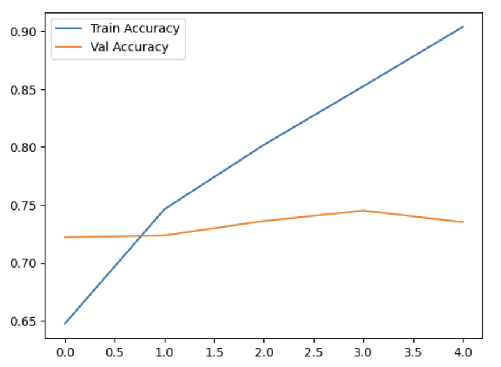
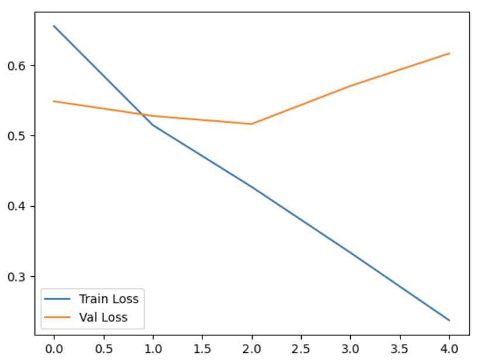
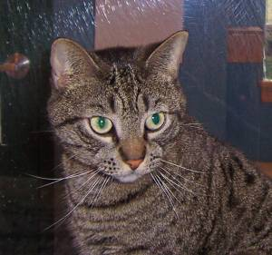
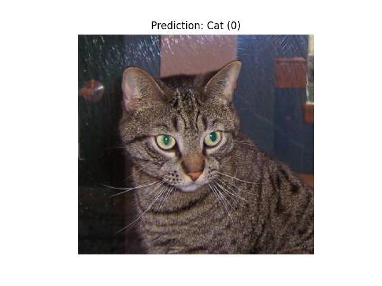
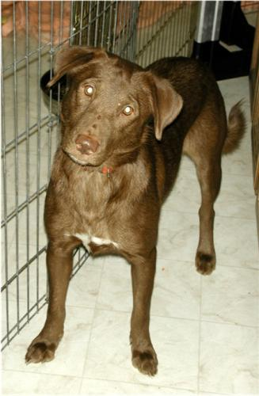
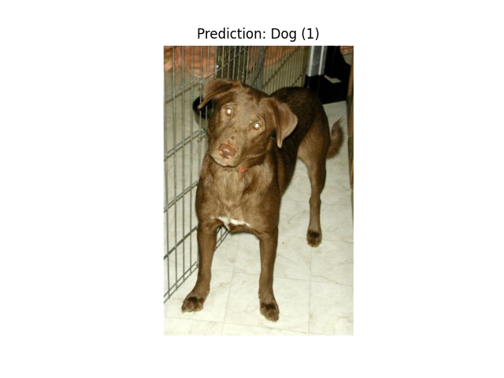

# Лабораторная 3
## Цель
Научиться создавать простые системы классификации изображений на основе сверточных нейронных сетей.

## Задание
1. Выбрать цель для задачи классификации и датасет (собрать либо найти, например, на Kaggle)
2. Зафиксировать архитектуру сети, Loss, метрику качества
3. Натренировать (либо дотренировать сеть) на выбранном датасете
4. Оценить качество работы по выбранной метрике на валидационной выборке, определить, переобучилась ли модель

## Реализация

### Теоретическая база

Классификация изображений — это одна из ключевых задач компьютерного зрения. Она заключается в определении категории объекта, представленного на изображении. Для решения таких задач применяются сверточные нейронные сети *(CNN)*, которые эффективно обрабатывают пространственную информацию в изображениях.

***Основные этапы работы CNN:***
- Извлечение признаков (через свертки и активации).
- Уменьшение размерности (через пулинг).
- Классификация с использованием полносвязных слоев.

***Преимущества CNN:***
- Локальное восприятие: обработка небольших областей изображения.
- Параметрическая эффективность: повторное использование фильтров.
- Хорошая масштабируемость для больших наборов данных.

### Описание разработанной системы

#### Архитектура системы
Разработанная система включает в себя:
- Использование папок `Cat` и `Dog` для обозначения классов.
- Предварительную обработку данных: фильтрация поврежденных файлов и выбор первых 5000 изображений.
- Обучение сверточной нейронной сети на основе TensorFlow и Keras.

#### Алгоритмы
- **Предварительная обработка данных**:
  - Удаление поврежденных файлов с использованием библиотеки PIL.
  - Разделение данных на тренировочную и валидационную выборки (80% и 20% соответственно).
- **Сверточная нейронная сеть**:
  - 2 сверточных слоя с пулингом.
  - Полносвязные слои для классификации.
  - Активация `relu` и `sigmoid`.

#### Системные требования
- Python 3.10 или выше.
- TensorFlow 2.0 или выше.
- Библиотеки: PIL, matplotlib, numpy.

## Результаты работы и тестирования системы

### Результаты обучения
- Точность на тренировочных данных: **`0.91%`**
- Точность на валидационных данных: **`0.74%`**

### Графики обучения
Ниже приведены графики изменения точности и потерь во времени:

<table align="center">
  <tr>
    <td align="center">
      
      
График точности

    </td>
    <td align="center">
      
      
График потерь

    </td>
  </tr>
</table>

### Примеры классификации

**Кошка**
<table align="center">
  <tr>
    <td align="center">
      
      
Оригинальное изображение

    </td>
    <td align="center">
      
      
Классификация: Cat (0)

    </td>
  </tr>
</table>

**Собака**
<table align="center">
  <tr>
    <td align="center">
      
      
Оригинальное изображение

    </td>
    <td align="center">
      
      
Классификация: Dog (1)

    </td>
  </tr>
</table>

### Закономерности
- Модель продемонстрировала стабильный рост точности на тренировочных данных с увеличением числа эпох.
- Однако точность на валидационных данных не увеличилась значительно после 3-й эпохи, что может свидетельствовать о переобучении (overfitting).
- Замечено, что качество предсказания ухудшается на изображениях с плохим качеством или сильными шумами.

## Выводы

- Разработана и обучена система классификации изображений, способная различать фотографии кошек и собак.
- Модель демонстрирует хорошую точность на тестовой выборке, что подтверждает корректность архитектуры и этапов предобработки данных.
- Дальнейшее улучшение модели возможно через:
  - Применение регуляризации (например, Dropout).
  - Увеличение объема данных.
  - Усложнение архитектуры модели.

## Использованные источники

1. Книга "Глубокое обучение на Python" — Шолле Франсуа.
2. [Официальная документация TensorFlow](https://www.tensorflow.org)
3. Kaggle Dataset: Microsoft Cats vs Dogs Dataset.

