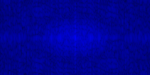
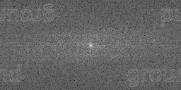
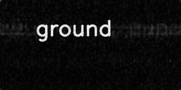

# Дополнительное задание

## Задание 
Дешифровать изображение из [датасета](https://disk.yandex.ru/d/MKqNNDe45eaiPw/img.zip)

## Реализация и результаты
### Первая итерация

#### Что натолкнуло на мысль
Вот так выглядит зашифрованная картинка:

<div style="display: flex; justify-content: center;">  </div>


На изображении заметен характерный узор, похожий на спектр частот, с яркой центральной частью и плавно затухающими краями. Это типично для представления данных в частотной области, например, после преобразования Фурье.

Такая структура (с ярким центром, где сосредоточены низкие частоты, и менее интенсивными краями для высоких частот) подтолкнула к мысли, что данные представляют собой закодированный спектр изображения.

#### Код
```python
def decode(image_path, output_dir):
    image = cv2.imread(image_path, cv2.IMREAD_GRAYSCALE)
    
    # ...

    f = np.fft.fft2(image) # Преобразование Фурье
    fshift = np.fft.fftshift(f) #  Центровка спектра частот
    magnitude_spectrum = np.log(np.abs(fshift) + 1) # Построение спектра амплитуд

    # Нормализация и сохранение результата
    output_image = np.uint8(255 * magnitude_spectrum / np.max(magnitude_spectrum))

    # ...
```
#### Результат

<table align="center">
  <tr>
    <td align="center">
      
      <p>Зашифрованное изображение</p>
    </td>
    <td align="center">
      
      <p>Результат дешифровки</p>
    </td>
  </tr>
</table>


### Вторая итерация

#### Оригинальный код кодирования
На второй итерации мы получили доступ к оригинальному коду кодирования, который сохраняет амплитуду и фазу преобразования Фурье в отдельные каналы изображения. Это позволило создать дешифровщик, который использует оба компонента для восстановления исходного изображения.

```python
def coder(img):
    f = np.fft.fft2(img)
    fshift = np.fft.fftshift(f)
    magnitude_spectrum = 20*np.log(np.abs(fshift))
    angle = np.angle(fshift)
    angle = angle - np.min(angle)
    img2save = np.stack([magnitude_spectrum, angle, np.zeros_like(img)], axis=2).astype(np.uint8)
    return img2save
```

#### Попытка инвертировать код

```python
def decode(image_path, output_dir):
    image = cv2.imread(image_path, cv2.IMREAD_COLOR)
    
    # ...

    # Разделяем каналы: амплитудный спектр (R), фаза (G)
    magnitude_spectrum = image[:, :, 0].astype(np.float32)  # Канал R
    angle = image[:, :, 1].astype(np.float32)  # Канал G
    
    # Восстанавливаем амплитудный спектр
    magnitude = np.exp(magnitude_spectrum / 20)
    
    # Восстанавливаем угловую фазу
    angle = angle / 6.0 * 2 * np.pi - np.pi  # Масштабируем из [0, 6] в [-π, π]
    
    # Формируем комплексное представление
    fshift = magnitude * np.exp(1j * angle)
    
    # Обратный сдвиг
    f_ishift = np.fft.ifftshift(fshift)
    
    # Обратное преобразование Фурье
    img_reconstructed = np.fft.ifft2(f_ishift)
    img_reconstructed = np.abs(img_reconstructed)
    
    # Нормализуем изображение для визуализации
    img_reconstructed = cv2.normalize(img_reconstructed, None, 0, 255, cv2.NORM_MINMAX)
    img_reconstructed = img_reconstructed.astype(np.uint8)
    
    # ...
```

#### Результат

<table align="center">
  <tr>
    <td align="center">
      
      <p>Зашифрованное изображение</p>
    </td>
    <td align="center">
      
      <p>Результат дешифровки</p>
    </td>
  </tr>
</table>

### Итог

Вот все слова с имеющихся картинок:
```text
that to end the in nor worms In dirty lived an smell sit dry hobbit-hole there Hobbit Not eat yet was nothing oozy or a filled nasty comfort bare of hole with wet ends down ground on sandy it
```

Из всех слов с картинок что-то похожее на часть вступления к книге "Хоббит, или Туда и обратно" Дж. Р. Р. Толкина:

```text
In a hole in the ground there lived a Hobbit. Not a nasty, dirty, wet hole, filled with the ends of worms and an oozy smell, nor yet a dry, bare, sandy hole with nothing in it to sit down on or to eat: it was a hobbit-hole, and that means comfort.
```

